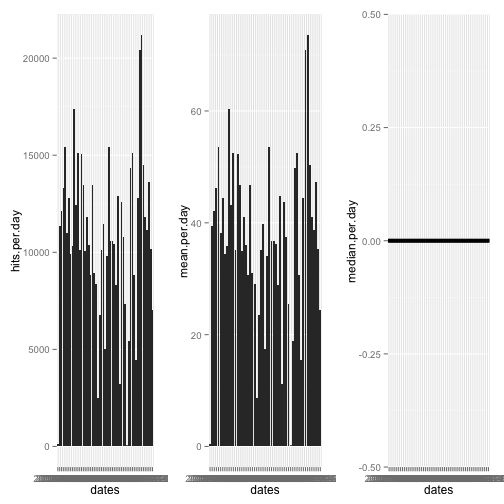
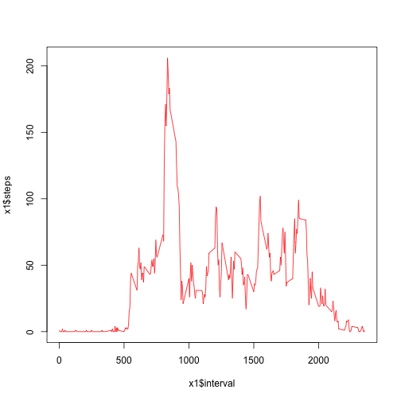
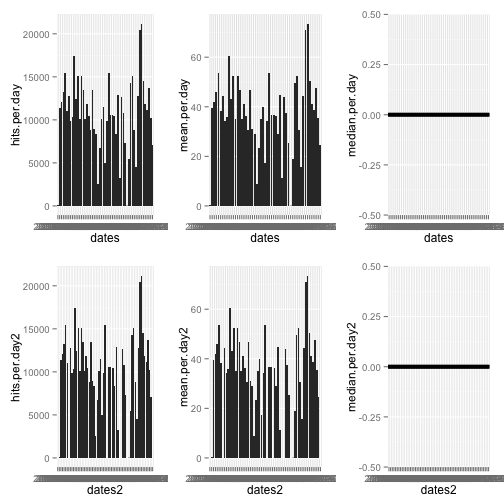
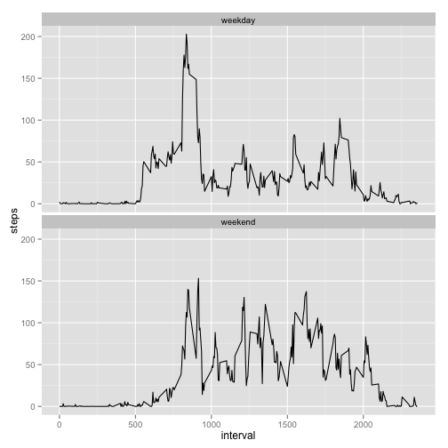

# Reproducible Research: Peer Assessment 1


## Loading and preprocessing the data

Here is the code for loading the data file activity.csv. A summary of the data is included.


```r
activity <- read.csv("activity.csv")
summary(activity)
```

```
##      steps               date          interval   
##  Min.   :  0.0   2012-10-01:  288   Min.   :   0  
##  1st Qu.:  0.0   2012-10-02:  288   1st Qu.: 589  
##  Median :  0.0   2012-10-03:  288   Median :1178  
##  Mean   : 37.4   2012-10-04:  288   Mean   :1178  
##  3rd Qu.: 12.0   2012-10-05:  288   3rd Qu.:1766  
##  Max.   :806.0   2012-10-06:  288   Max.   :2355  
##  NA's   :2304    (Other)   :15840
```


## What is mean total number of steps taken per day?

Here is a histogram of the total number of steps taken each day. Missing values have been removed. The day range without missing values is 10/2 to 11/29. It looks like the subject did a lot of walking around Thanksgiving.


```r
a2 <- activity[!is.na(activity$steps),]
dates <- unique(a2$date)
summary(as.Date(dates))
```

```
##         Min.      1st Qu.       Median         Mean      3rd Qu. 
## "2012-10-02" "2012-10-16" "2012-10-29" "2012-10-30" "2012-11-16" 
##         Max. 
## "2012-11-29"
```

```r
hits.per.day <- NULL
mean.per.day <- NULL
median.per.day <- NULL
for (i in dates) { 
  a3 <- a2[a2$date == i,]
  hits.per.day[i] <- sum(a3$steps) 
  mean.per.day[i] <- mean(a3$steps)
  median.per.day[i] <- median(a3$steps)
}
library(ggplot2)
p1 <- qplot(dates, hits.per.day, geom="histogram", stat="identity")
p2 <- qplot(dates, mean.per.day, geom="histogram", stat="identity")
p3 <- qplot(dates, median.per.day)

#
# multiplot function taken from "Cookbook for R" site at:
#
# http://www.cookbook-r.com/Graphs/Multiple_graphs_on_one_page_(ggplot2)/
#

multiplot <- function(..., plotlist=NULL, file, cols=1, layout=NULL) {
  require(grid)

  # Make a list from the ... arguments and plotlist
  plots <- c(list(...), plotlist)

  numPlots = length(plots)

  # If layout is NULL, then use 'cols' to determine layout
  if (is.null(layout)) {
    # Make the panel
    # ncol: Number of columns of plots
    # nrow: Number of rows needed, calculated from # of cols
    layout <- matrix(seq(1, cols * ceiling(numPlots/cols)),
                    ncol = cols, nrow = ceiling(numPlots/cols))
  }

 if (numPlots==1) {
    print(plots[[1]])

  } else {
    # Set up the page
    grid.newpage()
    pushViewport(viewport(layout = grid.layout(nrow(layout), ncol(layout))))

    # Make each plot, in the correct location
    for (i in 1:numPlots) {
      # Get the i,j matrix positions of the regions that contain this subplot
      matchidx <- as.data.frame(which(layout == i, arr.ind = TRUE))

      print(plots[[i]], vp = viewport(layout.pos.row = matchidx$row,
                                      layout.pos.col = matchidx$col))
    }
  }
}

multiplot(p1, p2, p3, cols=3)
```

 


## What is the average daily activity pattern?

Here is a time series plot (i.e. type = "l") of the 5-minute interval (x-axis) and the average number of steps taken, averaged across all days (y-axis)


```r
library(sqldf)
x1 <- sqldf("select interval, avg(steps) as steps from a2 group by interval")
plot(x1$interval, x1$steps, type="l", col="red")
```

 

Here is the 5-minute interval that contains the maximum average steps.


```r
x1[x1$steps == max(x1$steps),]
```

```
##     interval steps
## 104      835   206
```

The value "835" is 8:35am time bucket, so the walking peak appears to happen in the morning.

## Imputing missing values

The the total number of missing values in the dataset (i.e. the total number of rows with NAs) is given below. Date and interval columns were found to have no missing values.


```r
nrow(activity[is.na(activity$steps),])
```

```
## [1] 2304
```

Set missing values to zero and create a new dataset with the missing values filled-in.


```r
a1 <- activity
a1[is.na(a1$steps),]$steps <- 0
```

Here are histograms of the total number of steps taken each day and the mean and median total number of steps taken per day. Adding the zeros show there were missing days in the data above that eliminated missing values. Note that the graph now ranges from 10/1 to 11/30. 


```r
a2 <- a1
dates2 <- unique(a2$date)
summary(as.Date(dates2))
```

```
##         Min.      1st Qu.       Median         Mean      3rd Qu. 
## "2012-10-01" "2012-10-16" "2012-10-31" "2012-10-31" "2012-11-15" 
##         Max. 
## "2012-11-30"
```

```r
hits.per.day2 <- NULL
mean.per.day2 <- NULL
median.per.day2 <- NULL
for (i in dates2) { 
  a3 <- a2[a2$date == i,]
  hits.per.day2[i] <- sum(a3$steps) 
  mean.per.day2[i] <- mean(a3$steps)
  median.per.day2[i] <- median(a3$steps)
}
library(ggplot2)
p4 <- qplot(dates2, hits.per.day2, geom="histogram", stat="identity")
p5 <- qplot(dates2, mean.per.day2, geom="histogram", stat="identity")
p6 <- qplot(dates2, median.per.day2)
```

The "before" and "after" plots are shown below. These values do not differ significantly from the estimates from the first part of the assignment. However, the "missing"" days appear as empty slots in the histogram.


```r
multiplot(p1, p4, p2, p5, p3, p6, cols=3)
```

 


## Are there differences in activity patterns between weekdays and weekends?

Using the missing value imputed data, create a new factor variable in the dataset with two levels – “weekday” and “weekend” indicating whether a given date is a weekday or weekend day.


```r
daytype=ifelse(weekdays(as.Date(a1$date), abbreviate=TRUE) %in% c("Sat", "Sun"), "weekend", "weekday")
a1 <- cbind(a1, daytype)
```

Here is a panel plot containing a time series plot (i.e. type = "l") of the 5-minute interval (x-axis) and the average number of steps taken, averaged across all weekday days or weekend days (y-axis). It appears that the morning activity during the week is likely the commute to work starting just after 5am. The subject does not seem to need much sleep since he or she appears to stop walking around midnight. On the weekend the subject appears to wake-up at the same time but does much less morning walking.


```r
x2 <- sqldf("select daytype, interval, avg(steps) as steps from a1 group by daytype, interval")
g <- ggplot(x2, aes(x=interval, y=steps))
g + geom_line() + facet_wrap(~ daytype, nrow=2)
```

 
